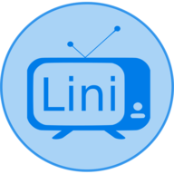

<p align="center"></p>

<h1 align="center">Lini</h1>
<p align="center">   
  <a href="https://github.com/grbull/lini/blob/master/LICENSE">
    
  </a>
  <a href="https://github.com/grbull/lini/blob/master/CHANGELOG.md">
    
  </a>
</p>

## 👋 Introduction

In the days of online streaming, it can be difficult to keep track of the tv shows you watch. Lini was created to be able to track them all in one place. Lini is a Progress Web Application which means it can be installed onto your computers and mobile devices, or accessed via a browser. It utilizes push notifications send reminders to users that their subscribed shows are about to air.

## 🚀 Technologies

**NestJS** was used for the backend because I'm a fan of its architecture and design principles and I have previous experience with it.

**React** was used for the frontend because I like the fact how flexible it is, I enjoy using redux for state management and hooks for decoupling logic.

## ⚒️ Installation

### Local development

```bash
# Clone repository
git clone https://github.com/grbull/lini.git

# Install apt dependencies
sudo apt npm install postgresql postgresql-client redis-server

# Install npm dependencies
npm install

# Copy example.env to .env
cp example.env .env

# Set the relevant variables to work on your machine
nano .env

# Setup the database
npm run db:sync

# Start in development mode w/ hot reload
npm run dev
```

### Deployment

Coming soon.

## 📖 Changelog

Wondering what we've shipped recently? Check out our [changelog](./CHANGELOG.md) for key highlights, performance improvements, new features, and notable bugfixes.

## 📝 License

Licensed under the [GNU AGPLv3 license](./LICENSE).

## ❤️ Thanks

Thanks to [TvMaze](https://www.tvmaze.com/api) for making their API available to everyone. Without them this project would not exist.
